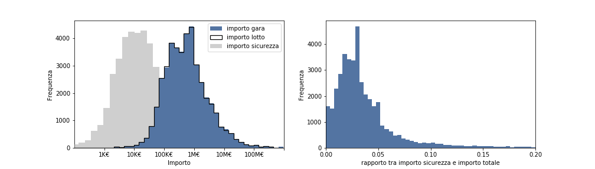
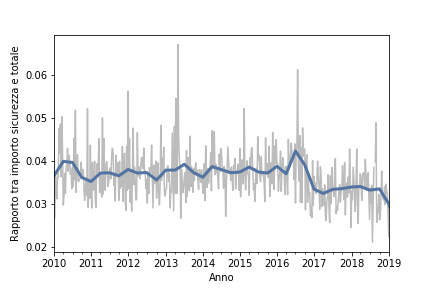
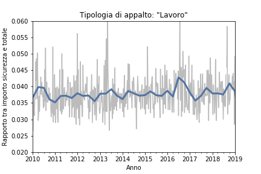
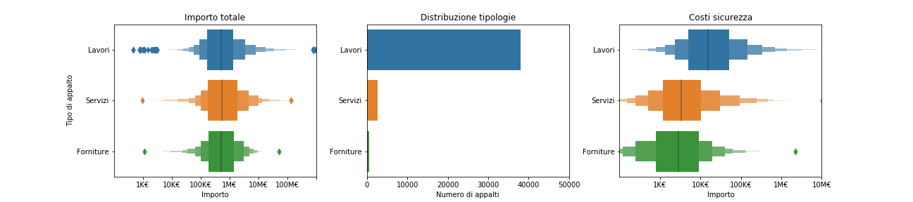
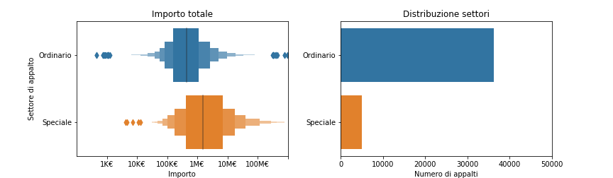
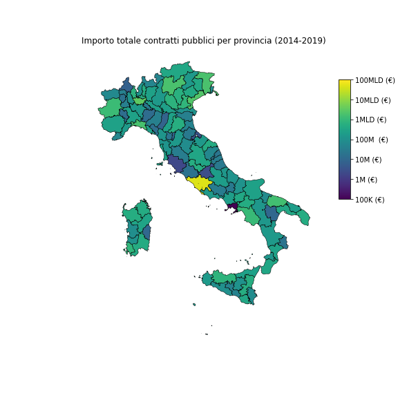

# OpenData ministero delle infrastrutture e dei trasporti


Sorgente dataset: http://dati.mit.gov.it/catalog/dataset/scp
## Banca dati Servizio Contratti Pubblici - SCP
Il Dataset contiene gli avvisi, i bandi e gli esiti di gara in formato aperto raccolti dalla Banca dati SCP - Servizio Contratti Pubblici gestita dalla Direzione Generale per la regolazione e i contratti pubblici del Ministero delle Infrastrutture e Trasporti. Maggiori informazioni sono disponibili sul sito www.serviziocontrattipubblici.it che consente alle stazioni appaltanti di pubblicare gli avvisi ed i bandi per lavori, servizi e forniture ed altre informazioni. Servizio Contratti Pubblici è una delle banche dati nazionali a titolarità del Ministero delle Infrastrutture e Trasporti elencate nell'allegato B del D.Lgs n.97/2016 (art. 9) che modifica l’obbligo di pubblicazione previsto nella normativa sulla trasparenza D.Lgs n.33/2013 (art. 9bis). I dati sono aggiornati quotidianamente.


## Colpo d'occhio



L'importo totale relativo ad un singolo bando di concorso è estremamente variabile con un valore tipico intorno al milione di euro. A causa trend negativo legato ai costi legati alla sicurezza sul posto di lavoro, questi, a partire dal 2016, vengono scorporati dal costo dell'importo assoggettato al ribasso durante il concorso. Il decreto legislativo 50/2016 (Codice contratti pubblici) indica che<sup>[1](#refpuntosicuro)</sup>:
```text
“...al fine di determinare l'importo posto a base di gara, individua nei documenti della procedura
i costi della manodopera sulla base di quanto previsto nel presente comma.
I costi della sicurezza sono scorporati dal costo dell'importo assoggettato al ribasso”. 
```

Dal grafico sulla destra si può osservare che l'importo associato ai costi relativi alla sicurezza è il media il 2.5% del valore totale del bando. Nel grafico seguente mostriamo l'andamento nel tempo del rapporto tra costi relativi alla sicurezza e importo totale:



Dal grafico sembra mostrare che, nonostante il D.Lgs. 50/2016, la spesa legata alla sicurezza sui luoghi di lavoro sia in diminuzione. Se filtriamo il dataset considerando solo i campi relativi a "lavoro" come tipologia di appalto, il risultato è diverso: escudendo gli appalti relativi ai servizi ed alle forniture, per i quali la sicurezza sul luogo di lavoro gioca un ruolo meno importante, la spesa relativa alla sicurezza risulta essere stabile nel tempo.




## Tipologia e settore di appalto

Dal 2006, con il decreto legislativo 163/2006, gli appalti pubblici possono far parte di tre diverse categorie: di lavori, di forniture o di servizi<sup>[2](#tipologie)</sup>:


- Appalti pubblici di lavori (e.g. attività di costruzione, demolizione, recupero, ristrutturazione, restauro e manutenzione di opere)
- Appalti pubblici di forniture (e.g. acquisto, locazione finanziaria, locazione o acquisto a riscatto di prodotti)
- Appalti pubblici di servizi (definiti dall'allegato II del D.Lgs. 163/2006)



Notiamo dal grafico sulla sinistra che l'importo di spesa totale per le diverse categorie è distribuito in modo omogeneo e, dal grafico centrale, che grande maggioranza di appalti riguarda la tipologia *lavori*. Il grafico sulla destra conferma che le tipologie di appalto riferite ai *lavori* richiedono una maggiore spesa relativa alla sicurezza. 

---------------

Una seconda classificazione della tipologia di appalto è quella che divide gli appalti ordinari e speciali. La topologia *appalto speciale*<sup>[3](#appaltospeciale)</sup> è frutto della direttiva europea 2014/25/UE, che identifica come appalti speciali quelli inerenti ad acqua, energia, trasporti e servizi postali. Questi settori vengono considerati *speciali* in quanto riguardano attività corrispondenti a bisogni fondamentali dei cittadini europei.



Notiamo che la maggior parte degli appalti vinti riguarda il settore ordinario, mentre i costi legati al settore speciale sono in media molto più alti (circa 10 volte maggiori).

## Distribuzione geografica

Da un punto di vista territoriale la spesa relativa agli appalti pubblici sembra essere distribuita in modo abbastanza omogeneo, ad eccezione della provincia romana. Nella provincia della capitale sono stati vinti appalti per un totale di circa 47 miliardi di euro tra il 2014 e il 2019, e a questa, segue con un grandissimo scarto la provincia di Milano con 3.2 miliardi. La media nazionale di spesa per provincia è di circa 780 milioni di euro, che corrispondono a circa 156 milioni di spesa annua. Riportiamo in grafico l'importo totale dei concorsi pubblici tra il primo gennaio del 2014 ed il primo gennaio del 2019 divisi per regione.




----------------

## Referenze

<a name="refpuntosicuro">1</a>: https://www.puntosicuro.it/sicurezza-sul-lavoro-C-1/tipologie-di-contenuto-C-6/appalti-costi-della-sicurezza-C-115/appalti-di-forniture-servizi-costi-della-sicurezza-normativa-AR-17740/ - Copyright © All Rights reserved 1999-2019 - All Rights Reserved.<br>
<a name="tipologie">2</a>: https://www.tuttocauzioni.it/appalti-pubblici/fondamenti-appalti-pubblici.<br>
<a name="appaltospeciale">3</a>: https://www.michelerizzolaw.com/it/gli-appalti-nei-settori-speciali-le-novita-contenute-nel-d-lgs-50-2016/.<br>


