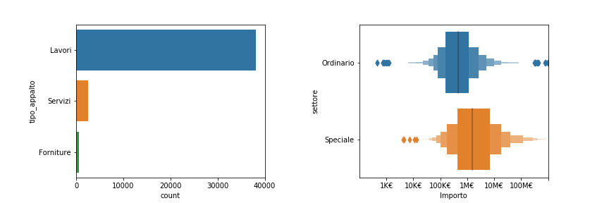

# OpenData ministero delle infrastrutture e dei trasporti


Sorgente dataset: http://dati.mit.gov.it/catalog/dataset/scp
## Banca dati Servizio Contratti Pubblici - SCP
Il Dataset contiene gli avvisi, i bandi e gli esiti di gara in formato aperto raccolti dalla Banca dati SCP - Servizio Contratti Pubblici gestita dalla Direzione Generale per la regolazione e i contratti pubblici del Ministero delle Infrastrutture e Trasporti. Maggiori informazioni sono disponibili sul sito www.serviziocontrattipubblici.it che consente alle stazioni appaltanti di pubblicare gli avvisi ed i bandi per lavori, servizi e forniture ed altre informazioni. Servizio Contratti Pubblici è una delle banche dati nazionali a titolarità del Ministero delle Infrastrutture e Trasporti elencate nell'allegato B del D.Lgs n.97/2016 (art. 9) che modifica l’obbligo di pubblicazione previsto nella normativa sulla trasparenza D.Lgs n.33/2013 (art. 9bis). I dati sono aggiornati quotidianamente.


## Colpo d'occhio


L'importo totale relativo ad un singolo bando di concorso è estremamente variabile con un valore tipico intorno al milione di euro. A causa trend negativo legato ai costi legati alla sicurezza sul posto di lavoro, questi, a partire dal 2016, vengono scorporati dal costo dell'importo assoggettato al ribasso durante il concorso. Il decreto legislativo 50/2016 (Codice contratti pubblici) indica che<sup>[1](#refpuntosicuro)</sup>:
```text
“...al fine di determinare l'importo posto a base di gara, individua nei documenti della procedura
i costi della manodopera sulla base di quanto previsto nel presente comma.
I costi della sicurezza sono scorporati dal costo dell'importo assoggettato al ribasso”. 
```

Dal grafico sulla destra si può osservare che l'importo associato ai costi relativi alla sicurezza è il media il 2.5% del valore totale del bando. Nel grafico seguente mostriamo l'andamento nel tempo del rapporto tra costi relativi alla sicurezza e importo totale:


Dal grafico sembra mostrare che, nonostante il D.Lgs. 50/2016, la spesa legata alla sicurezza sui luoghi di lavoro sia in diminuzione. Se filtriamo il dataset considerando solo i campi relativi a "lavoro" come tipologia di appalto, il risultato è diverso: escudendo gli appalti relativi ai servizi ed alle forniture, per i quali la sicurezza sul luogo di lavoro gioca un ruolo meno importante, la spesa relativa alla sicurezza risulta essere stabile nel tempo.


## Tipologia e settore di appalto




<a name="refpuntosicuro">1</a>: https://www.puntosicuro.it/sicurezza-sul-lavoro-C-1/tipologie-di-contenuto-C-6/appalti-costi-della-sicurezza-C-115/appalti-di-forniture-servizi-costi-della-sicurezza-normativa-AR-17740/ - Copyright © All Rights reserved 1999-2019 - All Rights Reserved.


